ReadMe

## 布局如下:

### 发现历史

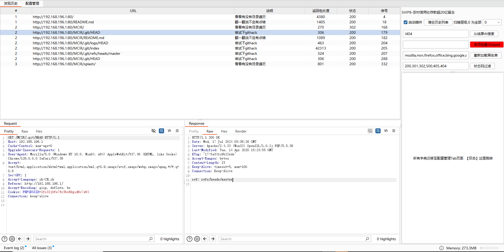

### 配置管理

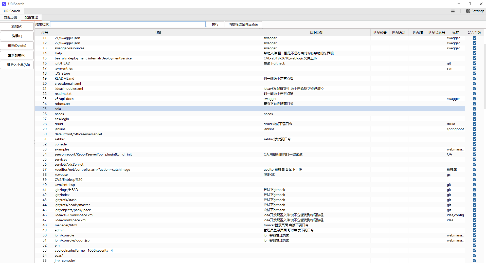

V2.0 ChangeLog:

1. 字典使用数据库方式进行管理, 方便后期扩展
2. 添加专项检查,在实际工作中有可能需要对某个专项进行查找,例如找swagger,或者xxl-job,使用专项的方式可以仅对字典中的专项进行检查,提高工作效率
3. 添加配置管理,所有字典信息均通过配置管理进行设置
4. 漏洞提醒,白话文提醒, 根据自己的字典直接提醒漏洞信息,不建议提醒漏洞官方编号
5. UE进行优化


## 食用说明

### 发现历史

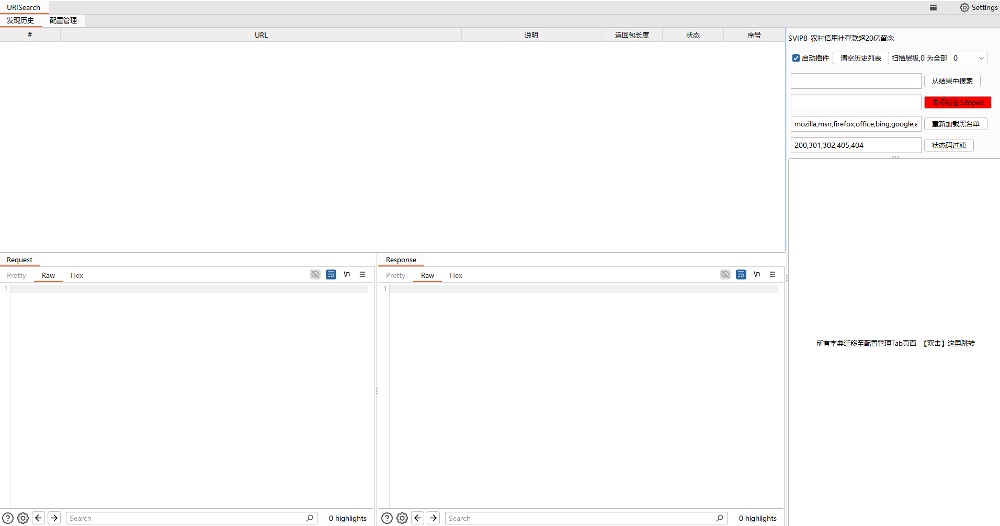

发现匹配信息后,左上角发现历史会 buling~buling~的闪, 其实没啥用~~~

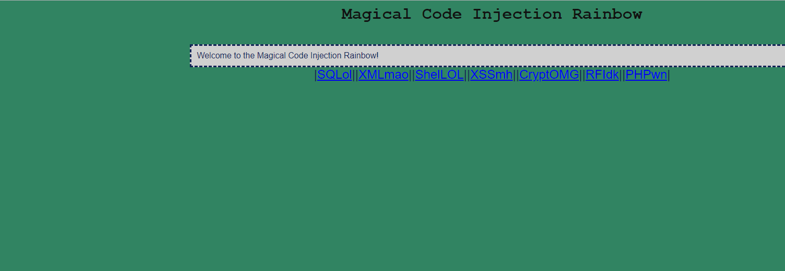

#### 层级扫描

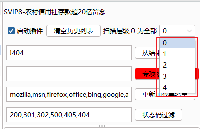

自定义层级,最高为4层, 0 为无层级限制,有多少就扫多少

假设自己的字典大小为200条, 如果一个url中包含 5级, 那么对这一个url发起的扫描数量为

⚠️ 1\*200\*5 =1000 条 ,发送数量会放大1000倍

带来问题如下:

1. ⚠️ 触发waf规则,ip可能被ban
2. ⚠️ 发送数量多大,burp内存使用量飙升  ⚠️ 请根据自己的需求使用 ⚠️ 

#### 结果搜索

如果历史太多,可以快速筛选表格数据, 支持多条件正负查看查询

语法: [!]查询条件&&[!]查询条件  

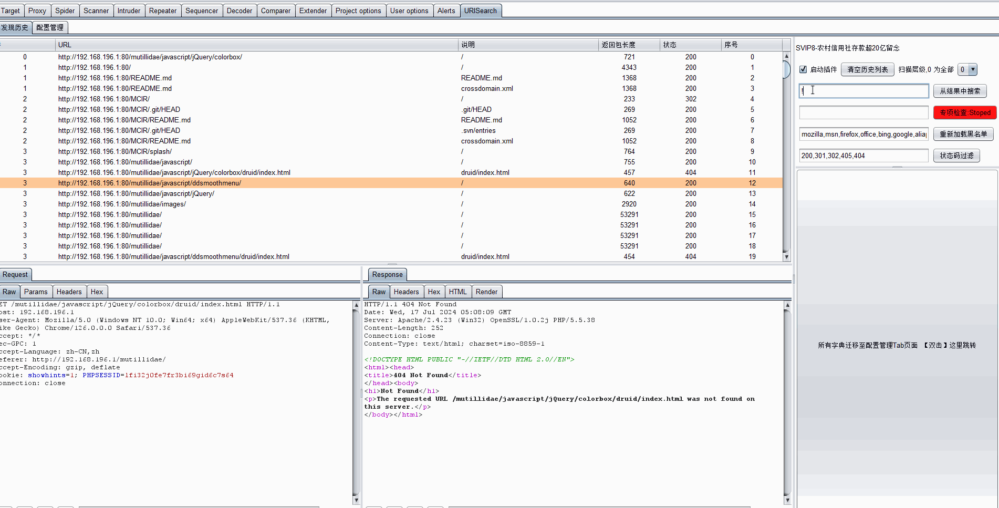

#### 专项检查

专项检查匹配值为配置管理中lab列数据

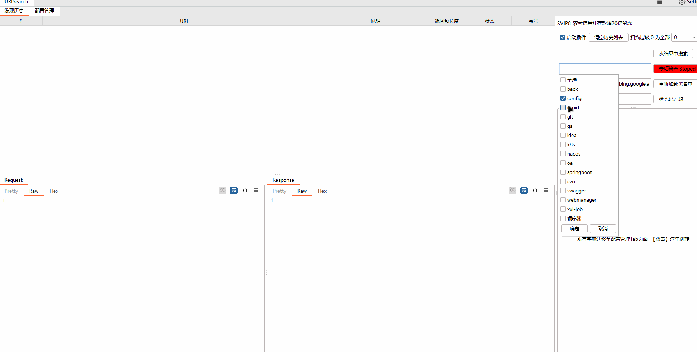

状态: Running 表示当前专项检查生效

​          Stoped 表示当前专项检查没有生效,使用全部字典

#### 黑名单

排除浏览器默认发起的请求, 规则, 只要在url包含关键字,则进行排除,在目录探测的时候不会对黑名单发起流量

目前黑名单列表:

```js
mozilla,msn,firefox,office,bing,google,aliapp,qianxin,baidu,g-fox,csdn,fofa,zone,github,microsoft,translator,qq,360,taobao,dingtalk,alicdn.com,apple.com,aliyuncs.com,sogou.com,microsoft.com,gvt1,teng.ai,qq.com,wps,apifox.com,xunlei,miui,qlogo.cn,qpic.cn
```

#### 状态码过滤

在发现历史中显示状态码要求显示对象,逗号"," 间隔, 文本框中回车或[状态码过滤]按钮被点击后生效

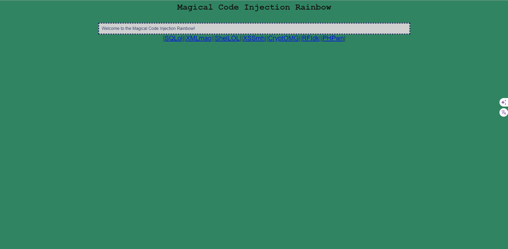


####  字典区按钮

原字典区修改为按钮,双击后进入配置管理,也可手动点击配置管理标签进入配置管理

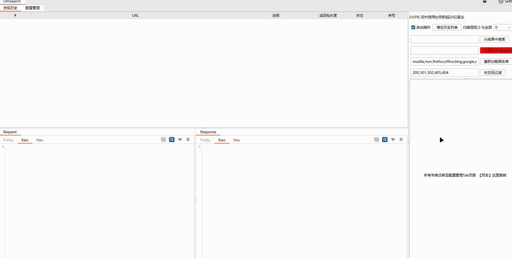


### 配置管理

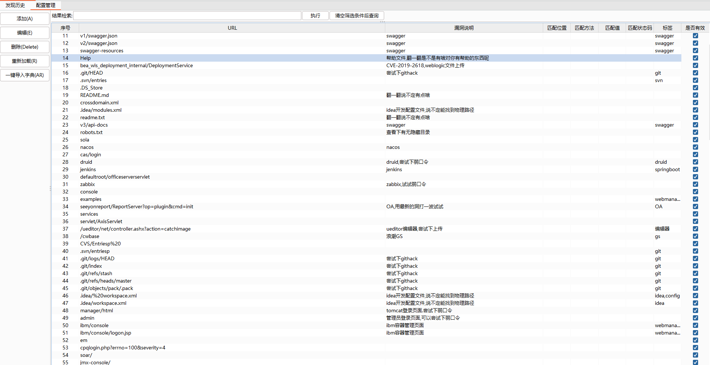

字典列表, 目前允许编辑列为 ,其他功能开发中

|  id   |       URL       |                     漏洞说明                      | 匹配位置 | 匹配方法 | 匹配值 | 匹配状态码 |                 标签                 |   是否有效   |
| :---: | :-------------: | :-----------------------------------------------: | :------: | :------: | :----: | :--------: | :----------------------------------: | :----------: |
| **❌** |      **✔️**      |                       **✔️**                       |  **❌**   |  **❌**   | **❌**  |   **❌**    |              ****✔️****               |    **✔️**     |
| 序号  | 要匹配地址的url | 发现历史标签页中的提示字段,建议根据自己的字典整理 |    /     |    /     |   /    |     /      | 专项检查标签,支持多标签,使用逗号间隔 | 是否有效状态 |


##### 快捷键及按钮说明

###### 添加(A)

​		添加一行数据

###### 编辑(E)

​		没有实质功能,提醒编辑操作方式

###### 删除(DELETE)

​		删除当前行

###### 重新加载(R)

​		重新加载全部字典

###### 一键导入字典(AR)

​		一键导入多行字典(开发中... ...)

为了提高UE体验,添加快捷键支持

###### 快捷键 **A** 

​		添加数据   等同 "添加(A)" 按钮

###### 快捷键 **D**

​		将选中行(多行)修改为不可用  (防止误删)

###### 快捷键 **F**

 		将选中行(多行)修改为不可用  (防止误删)

###### 快捷键 **T**

 		将选中行(多行)修改为可用

###### 快捷键 **R**

​		重新加载字典

###### 快捷键 **DELETE**

 		删除选中行(多行)

整体演示如下:

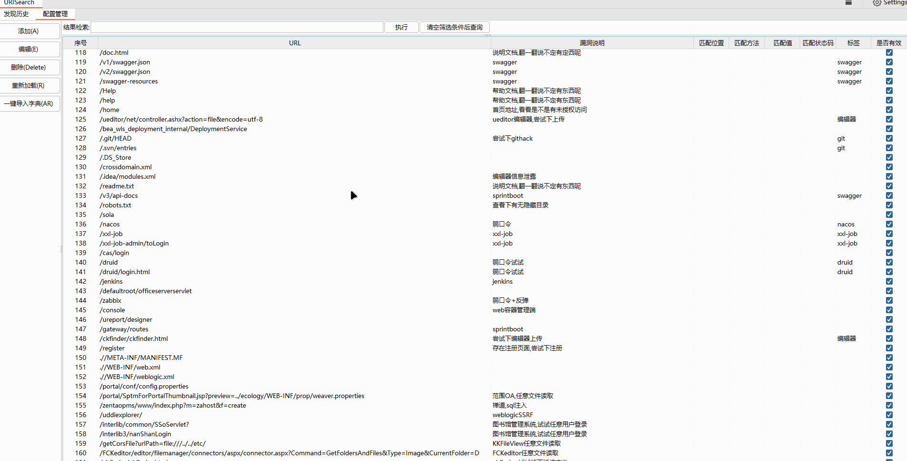

##### 批量插入/修改

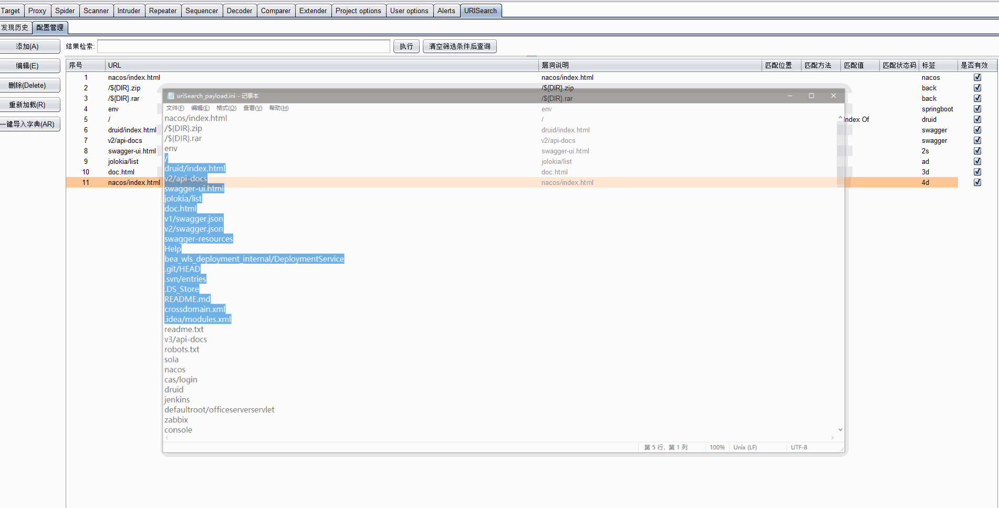

##### 列表检索

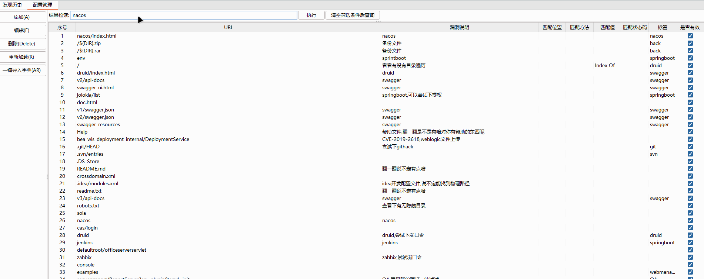


## TIPS:

**当发现出现bug的时候, 可以重启Burp**

# BUG:

目前在配置管理中更新标签后,功能区中专项检查下拉列表不会实施更新

# 更新历史

```
2024-7-14
-----------------------------------------
支持批量导入

2024-7-8
--------------------------------
1. 目前bug, 更新字典以后, 发现页面中专项检查下拉列表不刷新,需要重启burp方可刷新
2. 不支持多行导入

觅形uriSearch_V2.0
1.字典通过数据库进行处理
2.表格响应键盘DELETE事件, 为删除行
3.取消白名单,修改为标签事件, 即仅对标签内字典进行遍历


觅形 uriSearch_V1.7
1. 添加醒目提醒(其实没啥用)
2. 速度起飞(之前由于多线程处理不当,导致会生成相同序列号,现已修复,测试5000条,未发现串行的问题)

觅形 uriSearch_V1.6.1
1. 修改response和request显示形式
2. 修改清空列表后排序混乱的问题

觅形 uriSearch_V1.6
1. 修复清空数据后table样式混乱的问题
2. 添加结果搜索
3. 添加结果搜索,黑名单,状态码文本框回车事件


觅形 uriSearch_V1.5
1. 修复了数据串行的问题 2024-4-17

觅形 uriSearch_V1.4
1.添加${DIR}关键字 例如/${DIR}.zip,/${DIR}.rar 可以将当前目录作为参数

觅形 uriSearch_V1.3
1. 添加黑名单功能

觅形 uriSearch_V1.2.2.2
1. 修改排序按照string 排序的bug


觅形 uriSearch_V1.2.2
1.添加排序功能
2.修复排序后数据不对的bug
3修改默认列宽度


觅形 uriSearch_V1.2

2023-3-1
1.尝试修复时间长会卡顿的bug


2023-1-18
1.修改状态码为自定义  每次修改完状态码以后需要手动点击确定按钮, 否则不生效;
2.修改UI


觅形 uriSearch_V1.1

2023-1-16
1.修改默认探测范围为所有目录
2.添加根据状态码显示历史 默认进显示 2XX,3XX,5XX,其余不进行显示
3.添加白名单模糊匹配功能,  例如 aidu.com  会匹配 baidu.com aaidu.com,caidu.com. 92.168.100.10会匹配 192.168.100.103,292.168.100.104
4.优化易用性,尽量做到用起来更顺手


觅形 uriSearch_V1.0
2023-1-13
功能说明:
1.根据url路径探测路径下的字典中敏感信息
2.添加探测历史,防止二次扫描
3.清空列表后所有新进入url会清空探测历史
4.若使用自定义字典,请点击加载/重新加载字典按钮,点击按钮以后会将当前字典保存成字典,方便下次读取
5.显示探测历史,防止误报,可查看访问地址服务器返回的报文,人工判断防止误报

背景:
        红蓝对抗或者HVV中,有些有漏洞的应用会隐藏在正常目录下,
        例如 druid,  zabbix, xxl-job等,如果没有目录扫描工具费事费力,如不能及时发现有漏洞的应用可能丢失好多shell
	觅形 uriSearch为burp插件, 可以将自己手里的漏洞整理成字典,通过该插件对所有经过proxy的地址进行自动化地址探测,
	减少不必要的人工消耗,提高工作效率。


```

